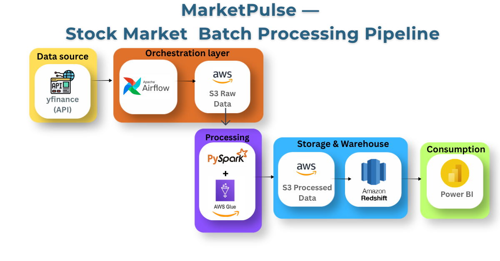

# MarketPulse 📈 — End-to-End Stock Market ETL Pipeline

**MarketPulse** is a fully automated Batch Processing Data Pipeline designed to extract daily stock market data, perform financial transformations, and load it into a data warehouse for Business Intelligence (BI) reporting. 

This project demonstrates core Data Engineering concepts including **Containerization, Orchestration, Data Lakes, Idempotency, and ETL Processing.**

---

## 🏗️ Architecture & Tech Stack



*   **Data Source (API):** Python (`yfinance` library)
*   **Orchestration:** Apache Airflow (Running on Docker)
*   **Data Lake (Storage):** AWS S3 (Raw Zone & Processed Zone)
*   **Data Transformation (ETL):** Designed for PySpark & AWS Glue (Big Data Scalability). Locally implemented and tested using Pandas.
*   **Data Warehouse:** Designed for Amazon Redshift. Locally implemented and tested using MySQL.
*   **Visualization:** Power BI (Connected to the database for dashboarding).

---

## ⚙️ Pipeline Workflow (DAG Tasks)

The pipeline is orchestrated via Apache Airflow and runs daily (Monday-Friday) at 9:00 AM.

1.  **`fetch_stock_data` (Extract):** Extracts live stock prices (Open, High, Low, Close, Volume) using the Yahoo Finance API and uploads the raw CSV to the AWS S3 Data Lake.
2.  **`transform_data` (Transform):** Reads the raw S3 data, cleans it (handles missing values), and performs feature engineering (calculates daily price change percentage and 7-day moving averages).
3.  **`load_to_mysql` (Load):** Loads the transformed data into the target database. **Crucially, this step is Idempotent:** it uses a `DELETE before INSERT` strategy to prevent duplicate records if the pipeline is re-run.

---

## 🛠️ How to Run Locally

### Prerequisites
*   Docker & Docker Compose
*   Python 3.10+
*   AWS Account (S3 Bucket credentials)
*   MySQL Server (Local)

### Setup Instructions

1.  **Clone the repository:**
    ```bash
    git clone https://github.com/IbrahimCheema-DE/MarketPulse-Data-Pipeline.git
    cd MarketPulse-Data-Pipeline
    ```

2.  **Configure Environment Variables:**
    Create a `.env` file in the root directory and add your credentials:
    ```env
    AWS_ACCESS_KEY_ID=your_aws_key
    AWS_SECRET_ACCESS_KEY=your_aws_secret
    S3_BUCKET_NAME=your_bucket_name
    MYSQL_HOST=host.docker.internal
    MYSQL_PORT=3306
    MYSQL_USER=your_user
    MYSQL_PASSWORD=your_password
    MYSQL_DB=marketpulse_db
    ```

3.  **Start Apache Airflow via Docker:**
    ```bash
    docker compose up -d
    ```

4.  **Access Airflow UI:**
    Open your browser and navigate to `http://localhost:8080`. Trigger the `marketpulse_pipeline` DAG to start the ETL process.

---

## 👨‍💻 Developer
**Ibrahim Cheema**  
Computer Science Student | Data Engineer  
